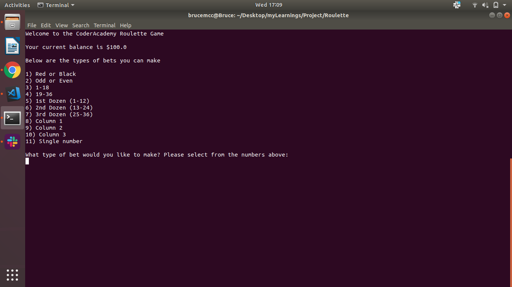

# Terminal App: Coder Academy Roulette
##### By Bruce Mcclure & Josephine Chong

GITHUB Link for Coder Academy Roulette: <https://github.com/brucemcclure/Roulette>

##Description of App

The goal/purpose of the Coder Academy Roulette Terminal Application is to mimic the casino/gaming experience and allow a user to play roulette from the comfort of their own terminal. It is for personal entertainment purpose.

The function of this gaming application is to allow a user to input value to guess the correct number or grouping (e.g. odd/even, red/black) against a randomly generated number. The fun is in guessing right and winning.

###Instructions for use
Step 1:  Download the file from GITHUB (above)
Step 2: Open app on terminal
Step 3: Select a which type of bet you want to play in roulette by selecting a number from '1' to '11' (1: RED/BLACK, 2: ODD/EVEN, 3: 1-18, 4: 19-36, 5: 1st Dozen, 6: 2nd Dozen, 7: 3rd Dozen, 8: Column 1, 9: Column 2, 10: Column 3, 11: Single number)
Step 4: Follow online instructions if bet type '1' or '2' is selcted you will have to input a number for 1(RED or BLACK) and 2 (ODD or EVEN)
Step 5: Enter monitary value you want to bet. You have a starting ledger value of $100. This is your maximum bet amount.
Step 6: Your betting result will display OR you will be prompted to enter a 'single number' to bet on
Step 7: You can replay roulette (enter 'y' for yes or 'n' for no, any other key will exit the game), UNLESS you have already played 10 games (if so you will not be allowed to replay unless you reopen the game in terminal)

 ******instructions screen shots (BRUCE put in for each step)

##Details of design

Brainstroming sessions

********Diagram (BRUCE TO INSERT)

Project plan and timeline

******(add TRELLO boards BRUCE)

### 1.	CODE STUCTURE

Code structure is a looped case statement with nested while loops for restricting incorrect user input, and overall loop and attached ledger document to record/tally the user’s the winnings and losses. The structure was designed around the 11 types of bets it is possible to place on a roulette table. A random generated number from the range 0-36 is issued and compared with your placed bets (bet type/number), and a message is displayed to show if you have won or loss. The winnings and the probability of you winning (the odds that you get when you win), are based on the roulette documentation from (URL from Bruce).

### 2. Higher level structure of the app ***BRUCE(e.g. why modules or functions were used or why separate files were utilized)

Separate files were utilised for ledger, main-game (foundation), (Bruce section) – to allow a running tally on the winning or losses after playing the game. The amount you start with and the number of games played will limit how long you play the game,
While loops were used for returning “error” messages when the user types in an invalid value, such as strings, symbols, empty spaces, and negative numbers will cause an error message and a loop to run until a number is entered for the betting game type of ‘betting on a single number’. The rescue term was used in ‘case 11’- ‘betting on a single number’ as it allowed the rejection of any value that was less than 0 and greater than 36, and allows you to prevent crashing the app if a string or symbol is used. This allowed the user to enter ‘0’ as a value to bet on as a single number.

### 3.	DATA TYPES USED ****BRUCE explain the rationale behind various choices of data-types

In order to create a ‘fool-proof’ game we have limited the type of input that the user can select to numbers (integers or floats), for placing bet amounts and selecting type of roulette bet/game. User names or “string” to collect user names were not necessary for this version of the game as it was intended for personal enjoyment, however it could be a future version (for future developers to work on) to include username and password and allow you to play among multiple users.

### 4.	EVIDENCE OF PLANNING ***BRUCE add screen shots
We used Tello, GitHub for project planning and collaborating. URL (INPUT) and web resources for research were used to ensure this App Roulette mimicked the real game and its winning probabilities. In order to make it as enjoyable as possible, we allowed users to repeat play if they wanted until they run out of funds (this was to mimic real-world conditions of what would happen when you run out of money gambling on the same game in a casino)

### 5. FUTURE OF APP ROULETTE
Future devs can make the game play more enjoyable by adding more user experience aesthetics in terms of gems to highlight when the game has been won or loss. It is also extendible by having username and password for users to have running record when they close the app, and also trying to make it a multiplayer game, so more than one person can play the game together. There could also be an animation of a spin before the randomised number is displayed to make the experience more immersive. 

Future devs - Put an age limit for persons below 16 – as there is a limitation to persons entering a casino for the prevention of developing bad addictive gambling habits

### 6. POTENTIAL LEGAL, MORAL, ETHICAL, CULTURAL AND SAFETY ISSUES OF APP

App is based off the addictive gambling game roulette so the potential legal issues could be if anyone used this app to gamble illegally. Moral, ethical, cultural and safety issues would be related to gambling addiction and this app can either aid or encourage this addiction which is why we have used a counter (see Bruce) to limit the number of times you can play the game at one time on terminal. A message with a hotline and URL for advice on gambling addiction is displayed when you reach your gaming limit (see Bruce)
(bruce) It should be known that there is an age limit for casinos, however if this ap is purely used for entertainment and not real gambling we have not added an age restriction but to use on your own accord/risk.
https://www.betsafe.com.au/policies/code_of_ethics/. 
This app can also be used to get yourself familiar/teach you this casino game of roulette, if you have never played before (for example if you were physically unable to go to a casino) this app will allow you to play the game as a form of entertainment. We are not liable for how this app is used, and do not recommend using this app to cultivate bad habits/addiction.

### 7. BROADER SOCIAL IMPACT OF APP  

The potential broader social implication of this game used for gambling is that if used in conjunction with betting real monies may be breaking the law/legislation depending on the place/country of use. This game does not discriminate, although it may mimic the game and therefore facilitate in increasing a persons addiction to the game, however this app was made purely for personal entertainment and not for intended for use which may harm or cause offence to any give people or persons of any age

